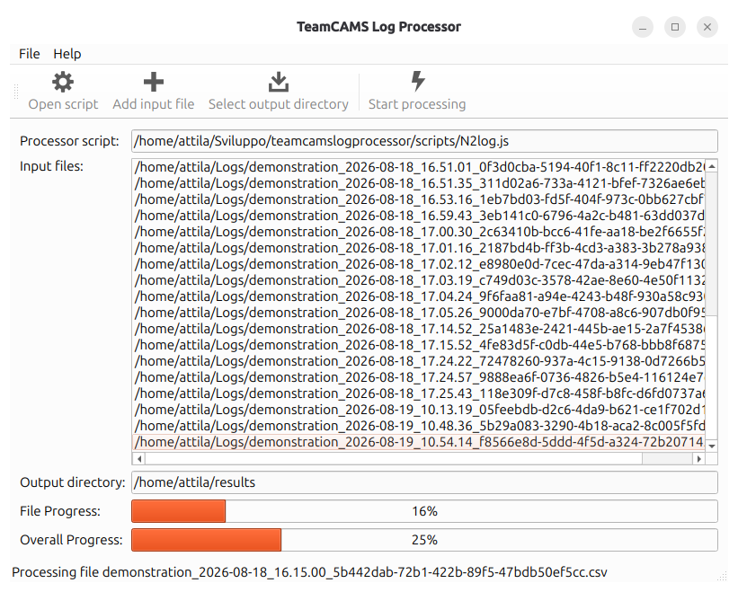

# TeamCAMS Log Processor

The TeamCAMS Log Processor is a data extraction and processing tool for the TeamCAMS research platform.

As part of the latest generation of TeamCAMS, which evolved from the AutoCAMS 2.0 research environment, the Log Processor simplifies the analysis of experimental data by automatically extracting, aggregating, and transforming information recorded during TeamCAMS sessions. It is designed to support researchers working with large datasets generated from single-user and multi-user experiments.

The tool eliminates the need for manual inspection of log files and enables efficient processing of multiple experimental sessions, facilitating subsequent statistical analysis and data preparation workflows.

## Features

- Automatic processing of TeamCAMS log files.
- Batch extraction of data from multiple experimental sessions.
- Aggregation of participant and experiment data.
- Conversion of raw event logs into analysis-ready datasets.
- Support for large collections of experimental records.
- Designed to streamline data preparation for statistical analysis.
- Integration with the TeamCAMS research ecosystem.

## Purpose

TeamCAMS experiments generate detailed logs containing information about participant actions, system events, performance measures, communications, automation states, and experimental conditions.

The Log Processor automates the extraction of relevant information from these logs, reducing the time required to prepare datasets for analysis and minimizing the risk of manual processing errors.

Typical uses include:

- Processing data from individual studies.
- Combining results from multiple experimental sessions.
- Extracting performance metrics.
- Preparing datasets for statistical software.
- Supporting reproducible research workflows.

## How It Fits Into TeamCAMS

The TeamCAMS ecosystem consists of four main components:

### Script Editor

Used to create and edit experimental scenarios.

Repository:

https://github.com/slashdotted/TeamCAMS-ScriptEditor

### Experiment Manager

Used to configure and run experimental sessions.

Repository:

https://github.com/slashdotted/TeamCAMS-Manager

### Operator Interface

The web-based client used by study participants.

Repository:

https://github.com/slashdotted/TeamCAMS-OperatorInterface

### Log Processor

This application.

Used after data collection to process and extract information from TeamCAMS log files.

## Typical Workflow

1. A researcher creates a scenario using the Script Editor.
2. The scenario is executed through the Experiment Manager.
3. Participants interact through the Operator Interface.
4. TeamCAMS records all experimental events and participant activities.
5. The generated log files are processed using the Log Processor.
6. Extracted datasets are imported into statistical or data analysis software.

## Screenshot

### Main Window

The Log Processor provides a simple interface for selecting, processing, and extracting data from TeamCAMS experimental logs.

## Research Background

TeamCAMS (Team Cabin Air Management System) is a research platform developed to investigate human behavior in complex socio-technical environments, including teamwork, automation, adaptive automation, and human-AI interaction. The Log Processor was developed to support efficient post-experimental data analysis and to facilitate large-scale research studies based on TeamCAMS-generated data.

The current TeamCAMS platform has been developed since 2015 by **Amos Brocco** as part of a collaboration between:

- Cognitive Ergonomics and Work Psychology Team, Department of Psychology, University of Fribourg, Switzerland
- Department of Innovative Technologies, University of Applied Sciences and Arts of Southern Switzerland (SUPSI)

## Supported Platforms

Currently distributed for:

- Linux
- Windows

The application is designed as a cross-platform tool.

## License

TeamCAMS Experiment Manager is released under the terms of the GNU General Public License v3.0 (GPL-3.0).

See the `LICENSE.txt` file for details.

## Citation

If you use TeamCAMS in scientific work, please cite the corresponding TeamCAMS publication once available.

## Contacts

**Software development and project information**  
Amos Brocco  
Department of Innovative Technologies (SUPSI)  
Email: amos.brocco [at] supsi [dot] ch

**Scientific inquiries, research use, and collaborations**  
Cognitive Ergonomics and Work Psychology Team  
Department of Psychology, University of Fribourg, Switzerland  
https://www.unifr.ch/psycho/en/department/staff/teams/cogerg.html
